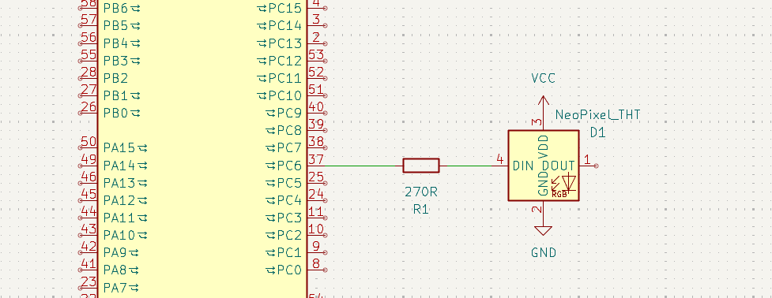

# STM32 Discovery Kit NeoPixel Controller

A bare-metal C project for the STM32F100RB Discovery board that controls a NeoPixel LED with smooth color transitions using PWM via DMA.

I made this because I wanted to learn how to use DMA and timers for controlling the NeoPixel LED, so the descriptive comments are a feature - it's there for me to understand the setup of the peripherals.

## What This Does

The project drives a WS2812B (NeoPixel) LED through smooth color transitions (red → yellow → green → cyan → blue → magenta → red) while simultaneously blinking the two onboard LEDs in an alternating pattern.

## Connection Schematic



Connect the NeoPixel DIN pin to **PC6** on the STM32F100RB Discovery board.

## Building Blocks

### Clock Configuration (`RCC_Configuration`)

- Configures the external 8MHz HSE oscillator
- Sets up PLL with 3x multiplier for 24MHz system clock
- Provides precise timing needed for NeoPixel protocol

### GPIO Setup (`GPIO_Configuration`)

- **PC6**: PWM output for NeoPixel DIN (alternate function, TIM3_CH1)
- **PC8 & PC9**: Onboard LED outputs for status indication

### NeoPixel Control

**Timer 3 + DMA** (`NeoPixelTimerAndDMA_Configuration`):

- TIM3_CH1 generates 800kHz PWM signal (1.25μs period)
- PWM duty cycle encodes bits: `NEOPIXEL_ZERO` (8/30 ≈ 0.35μs) and `NEOPIXEL_ONE` (17/30 ≈ 0.7μs)
- DMA1_Channel6 automatically transfers 24-bit color data (GRB format) from `neopixel_buffer` to TIM3->CCR1
- Non-blocking operation allows main loop to calculate next color value

**Color Update** (`setNeoPixelValue`):

- Converts 8-bit RGB values to 24 PWM pulses in the buffer
- Bit-shifts each color component to generate proper timing signals
- Automatically triggers DMA transfer when ready

### LED Blinking

**Timer 17** (`BlinkTimer_Configuration`):

- 1-second interrupt-driven state machine
- Alternates between PC8 and PC9 LEDs for visual feedback

### Main Loop

Implements smooth color cycling by incrementing/decrementing RGB values through six transition phases with a 1ms delay between steps.

## Build & Upload

```bash
pio run -t upload
```

## Hardware Requirements

- STM32F100RB Discovery board (very old board that one)
- WS2812B NeoPixel LED (or compatible)

## Programming Details

- Program: Platformio in VSCode
- Framework: STM32Cube (bare-metal)
